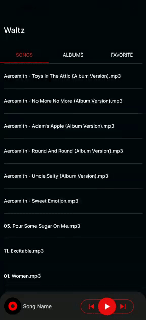

## Music Player
Simplesmente um player de musica.<br>


## Tecnologias Utilizadas

- [React Native](https://reactjs.org)
- [Expo](https://docs.expo.dev/)
- [Yarn](https://yarnpkg.com/)

## Como executar
Clone o projeto e acesse  a pasta do mesmo.

para iniá-lo, siga os passos abaixo:

```bash
# Iniciar o projeto
$ expo start
```
Lembrando que e necessário ter o expo-cli instalado.
